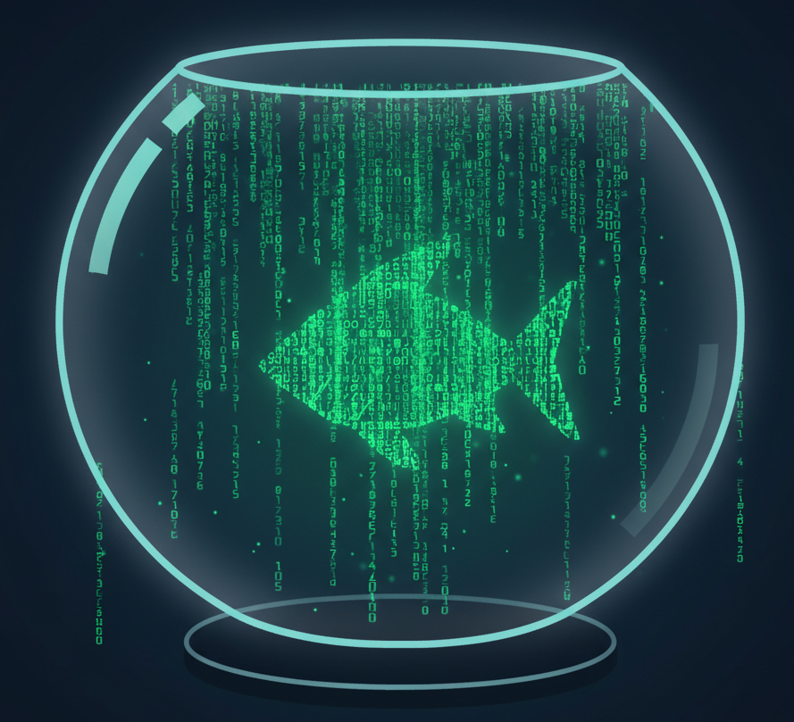

<p align="center">
  
</p>

# Fishbowl

**Fully verifiable, reproducible AI LLM training from layer zero.**

Fishbowl is a research initiative to build LLM training pipelines where any technically capable third party can independently reproduce the exact model weights — verified by sha256 fingerprint — from source, using public tools, a public dataset, and a public build environment.

The difference between *"don't be evil"* and *"can't be evil."*

## Why

Most "open source" AI models today only release weights — the finished artifact. They don't release the training data, training code, research decisions, or a reproducibility guarantee. Users must trust the builder's intentions. Fishbowl eliminates that trust requirement through structural verifiability.

The same principle as Linux (source code is the law) and Bitcoin (protocol enforces the rules): **rules without rulers.**

## The Stack

```
Layer 1: Research provenance
  → Git log = complete decision history from commit zero

Layer 2: Training data
  → Legally clean, fully documented corpus (Common Pile / Dolma / domain-specific)

Layer 3: Hermetic build environment
  → Pinned Docker image (Ubuntu + CUDA + PyTorch + Python, all exact versions)

Layer 4: Deterministic training kernels
  → Bit-exact reproducibility on same GPU model + driver + CUDA + PyTorch

Layer 5: Verification artifacts
  → sha256 of weights, Docker image, dataset, and git commit hash at every checkpoint
```

## Verify a Model

```bash
# Pull pinned build environment
docker pull <registry>/fishbowl-build@sha256:<image_hash>

# Run training (same GPU model required)
docker run --gpus all fishbowl-build ./train.sh

# Verify
sha256sum output/model_final.bin
# Compare to published: <expected_hash>
```

Same-GPU-model constraint is analogous to "same compiler version" in Linux kernel builds — a reasonable, well-precedented scope.

## Roadmap

**Phase 1 — Proof of concept (single GPU, small model)**
- [ ] Fork [autoresearch](https://github.com/karpathy/autoresearch) as training foundation
- [ ] Add `torch.use_deterministic_algorithms(True)` and LayerCast/FP32 mode
- [ ] Wrap in pinned Docker image (CUDA + PyTorch + Python exact versions)
- [ ] Add sha256 verification of dataset in prepare.py
- [ ] Run two independent training runs on same GPU, compare weight sha256
- [ ] Publish: model weights + sha256 + Docker image + sha256 + dataset + sha256

**Phase 2 — Community verification**
- [ ] Write `verify.sh`: pull container, run training, compare sha256, report result
- [ ] Invite community members with same GPU to verify independently
- [ ] Document hardware compatibility matrix

**Phase 3 — Specialized domain model**
- [ ] Choose a niche domain with a legally clean, fully documentable dataset
- [ ] Train a small (1-7B) specialized model using the Phase 1 pipeline
- [ ] Full public release with complete provenance chain

## Key References

| Resource | Description |
|---|---|
| [autoresearch](https://github.com/karpathy/autoresearch) (Karpathy) | Layer-zero training with git provenance |
| [OLMo](https://allenai.org/olmo) (Ai2) | Closest existing truly open model |
| [Dolma](https://huggingface.co/datasets/allenai/dolma) (Ai2) | Open training corpus |
| [Common Pile](https://arxiv.org/abs/2506.05209) (EleutherAI) | Legally clean dataset initiative |
| [SGLang deterministic inference](https://lmsys.org/blog/2025-09-22-sglang-deterministic/) | Batch-invariant kernels |
| [LayerCast](https://arxiv.org/abs/2506.09501) | FP32 determinism approach |
| [Reproducible Builds](https://reproducible-builds.org) | Methodology reference from software |

## Philosophy

The goal is not to produce the most capable model. It is to produce the most *verifiable* model — one where capability and trustworthiness are independently auditable by anyone.

Every decision documented. Every artifact fingerprinted. Every build reproducible. Not because we assume bad actors, but because a system that *structurally cannot* hide bad behavior is more trustworthy than one that merely *promises* not to.

## License

[MIT](LICENSE) — Fabio Pedrazzoli Grazioli and Claude.
